# V3 Streams Integration App Guide


## Overview

This guide explains what the Dsco V3 Streams Demo App does and how it works. The Dsco V3 Streams Integration App provides an example of how a retailer could use the V3 streams APIs to integrate with Dsco. It is only designed to run in Dsco's staging environment and not the Dsco production environment.

## Install Gradle

Install Gradle from here: [https://gradle.org/](https://gradle.org/)

## Build and Run the App

Build the app…
```
gradle build
```

Run the app…

```
java -jar build/libs/v3stream-1.0-SNAPSHOT.jar
```

You will see this…

```
15:29:13.324 \[main\] INFO io.dsco.demo.StreamsDemonstration - No properties file found. A default properties file has been created the resources directory. Please populate it with appropriate values before rerunning the application.
```

Continue to the next section to provide credentials.

## Provide Credentials

The app will create a properties file for you to provide credentials within after you have run the app for the first time. The file is located here…

```
<project_root>/src/main/resources/dsco.properties
```

Open that file and populate the placeholders…

```
v3.oauth.url=xxxxxx
base.v3.url=xxxxxx

retailer.accountId=xxxxxx
retailer.v3.clientId=xxxxxx
retailer.v3.secret=xxxxxx

supplier.accountId=xxxxxx
supplier.v3.clientId=xxxxxx
supplier.v3.secret=xxxxxx
supplier.skus=xxxxxx,xxxxxx,xxxxxx
```
* * *

You will need to provide your Dsco account ID and that of one of your suppliers. Also, this demonstration is designed from the retailer’s perspective for now, so if you're not a retailer this won't work.

* base.v3.url

  The URL to the Dsco V3 APIs. staging: [https://staging-api.dsco.io/api/v3/](https://staging-api.dsco.io/api/v3/)

* v3.oauth.url

  The URL to the Dsco V3 Oauth2 Get Access Token API
  [https://staging-api.dsco.io/doc/v3/reference/#tag/OAuth2](https://staging-api.dsco.io/doc/v3/reference/#tag/OAuth2)
  
  staging: [https://staging-api.dsco.io/api/v3/oauth2/token](https://staging-api.dsco.io/api/v3/oauth2/token)

* supplier.v3.clientId

  The client ID for your supplier trading partner; you will need to get a clientId and clientSecret from Dsco for your supplier trading partner before continuing if you haven't already

* supplier.v3.secret

  The client secret for your account; you will need to get a clientId and clientSecret from Dsco before continuing if you haven't already

* supplier.accountId

  You must provide the Dsco account ID for one of your supplier trading partners, the one whose V3 auth credentials you have used in this properties file

* retailer.v3.clientId

  The client ID for your account; you will need to get a clientId and clientSecret from Dsco before continuing if you haven't already

* retailer.v3.secret

  The client secret for your account; you will need to get a clientId and clientSecret from Dsco before continuing if you haven't already

* retailer.accountId

  Your Dsco account ID, if you don't know it contact Dsco to get it

Build and run the app again…

```
gradle ​build
java ​-​jar build/libs/v3stream-1.0-SNAPSHOT.jar
```

If you see this, then it worked…

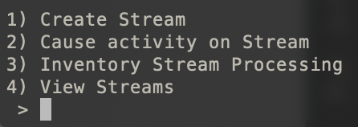

## Fundamental Concept: the Stream

The whole purpose of this demo is to help you understand what a stream is and how to get data from Dsco using streams as a retailer. If you want to cut to the chase, skip down to where it says “The New Hotness” below.

### The Old Crusty Way

The old way of getting data from a remote system, was to allow a user to call an API, passing in query parameters, and then synchronously get back a page of results that matched the criteria passed in. Then, if the data returned from the API call indicated that there are more pages the user will keep calling in to the API to get each successive page of results.

What's wrong with this?

Will this old way work? Of course, but what will it cost you to own and maintain this integration? How easily will you recover from failure? What will it cost Dsco to provide this solution? You may think you don’t care what it costs Dsco, but cost usually means complexity and thus risk.

* This approach forces Dsco to search in real time for what changed which is costly, prone to variability in performance and also requires Dsco to save the entire transient result set from the search so you can make subsequent API calls to page through them

* The retailer is forced to keep calling in and get all the pages of the result set before Dsco’s reaper kicks in and deletes the saved results from the initial search (five minutes)

* The retailer is forced to keep track of the last time they called in to get what changed so they can pass it to Dsco in the API call

* Dsco is forced to carefully ensure that race conditions don’t allow for any individual change to get missed

* The retailer is forced to pass in not one date but two dates that bound the search for change to in order to minimize/eliminate the possibility of skipping events

### The New Hotness

_This is a conceptual understanding of a stream. Later we will dive into the technical specifics._

Now enters the hero of our story: streams. For our purposes, a stream is a semi-persistent sequence of ordered data events. Developers want to access remote data. They want that remote data queued up and ready to return instantly. They want to pull down the stream data at whatever speed they can consume it. They want the data to be ordered in sequence so it’s easy and safe to process. They don’t want to have to keep track of anything. They just want to open a spigot and have the data come down.

Here’s how it works…

1. A developer at a retailer will create a stream, let’s say an inventory stream, and they will specify in a query object that they want Dsco to stick into the stream any item whose quantity changes, allowing the retailer to track changing quantities across all inventory

1. The developer will then make a query to Dsco, specifying the stream in question and get back the current position of the stream, which is the point after which any new events in the stream are waiting to be processed

1. The developer calls into Dsco, passing in the stream ID and the just received position and starts getting back new events from that position forward in time

1. As the developer gets events and successfully processes the inventory quantity change data, the developer will post back to Dsco the stream ID and the fact that the developer has processed up to the position of the given event, meaning that the stream can now change its “current position” to be beyond that point

1. The developer has his app wakes up every minute or so and asks for the current position, gets any new events after that position, updates back to the stream the new processed-up-to-this-point position and keeps going

## Understand the App

The app demonstrates how to create a stream and use streams for each of the stream types a retailer will likely be interested in. The app wouldn't be very useful if it didn't also facilitate populating data into the streams, so it does that too.

> Note that throughout the app, simply type the number of the menu item you're interested in and hit enter to execute that menu item.

## Main Menu

The doc will go deep into each of these menu items later. For now, let's just get an overview of what each one does.

When you first run the app, you will see this main menu…


### Create Stream

Type 1 and hit enter and you will see this menu, allowing the user to pick what type of stream to create.

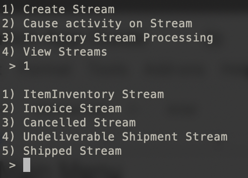

### Create ItemInventory Stream

Type 1 again to create a new inventory change stream. You will be prompted to provide a “streamId” which is just a unique name for your stream. Give it a name (I named mine inventory-change-stream), hit enter and you will see output that indicates that it has been created. When it’s done it takes you back to the main menu.

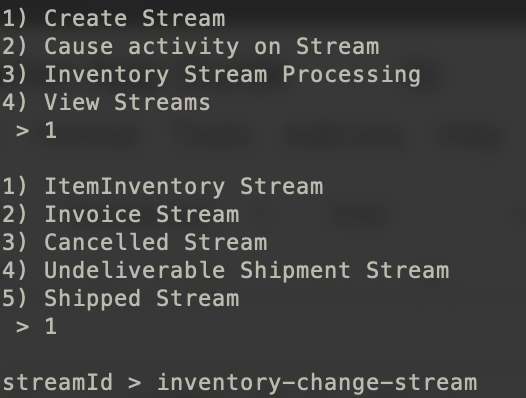

You now have a stream named inventory-change-stream that is ready to use.

### Create Other Streams

You can continue on and create the other types of streams. Here’s documentation on the types of streams you can create:

```
https:​//​staging-api.dsco.io​/doc/​v3​/reference/​#operation/createStream
```

Go to that URL and scroll down until you see the Request Body Schema as in...

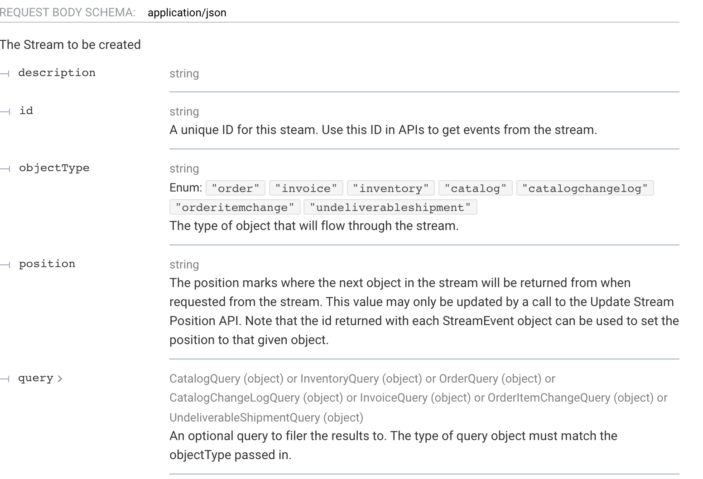

You will specify the objectType that designates what type of object will flow through the stream. Now click on the “query >” label and it will expand and show you the different types of streams that can be created and the query params available for each.

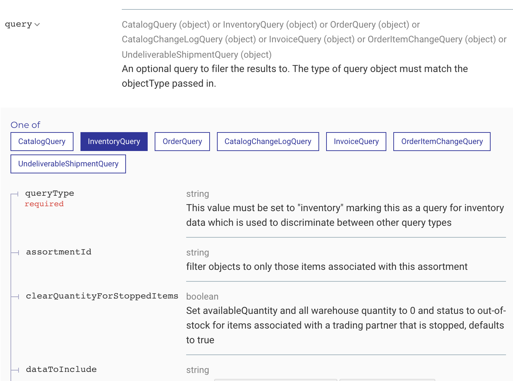

Go to this API doc to determine the stream object type that will flow down the stream:

```
https:​//​staging-api.dsco.io​/doc/​v3​/reference/​#operation/getStreamEventsFromPosition
```

Now scroll down to the Responses and click on the “200” response and then click on the “payload >” label to see the different response objects that may be returned depending on the stream type:

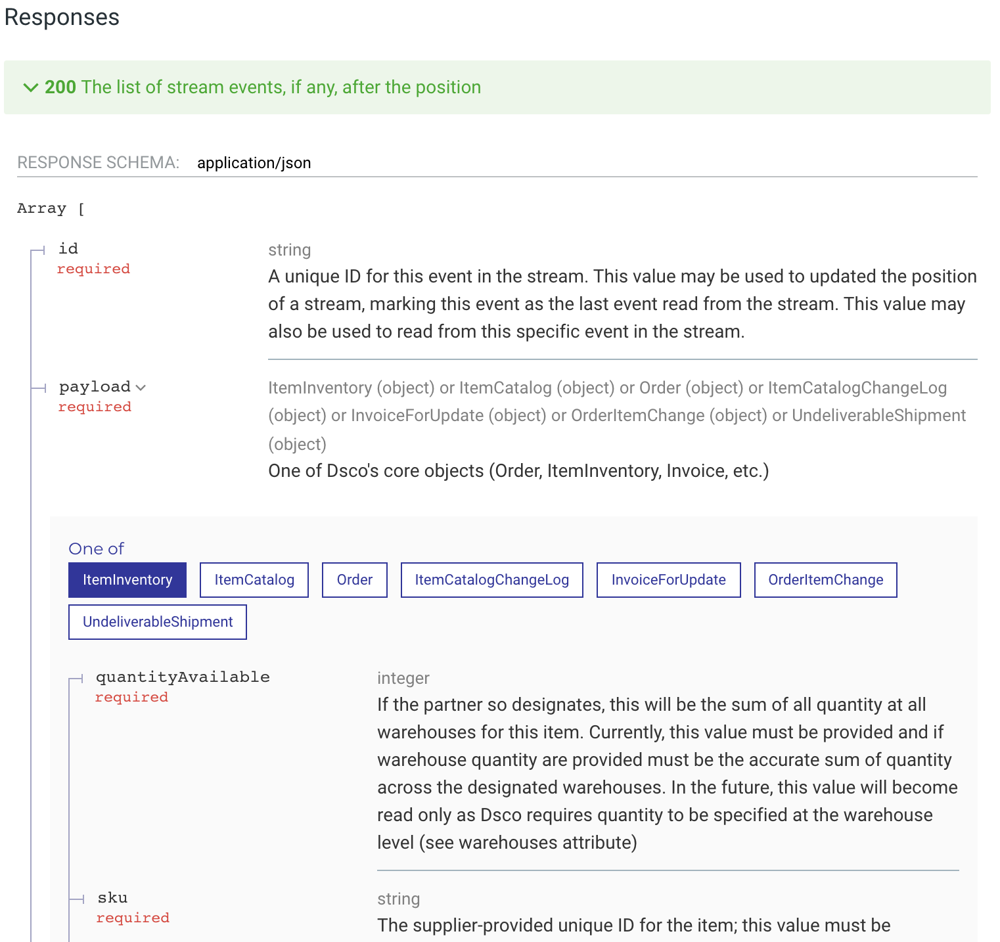

### Cause activity on Stream

Type 2 and hit enter and you will see this menu, allowing the user to create or modify objects so that the change will flow down into any created streams that might be listening for this change.

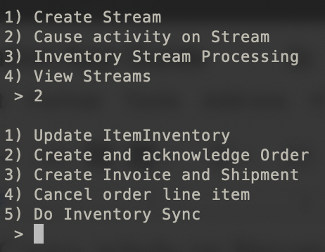

### Update ItemInventory

When items are created or updated the changed objects will flow into any inventory streams that you have created. Use this menu item to change an item’s inventory quantity so you can see actual item objects flow into your events. You will be prompted to provide “number of items to update >” and I put 5 and then saw the output representing doing this work.

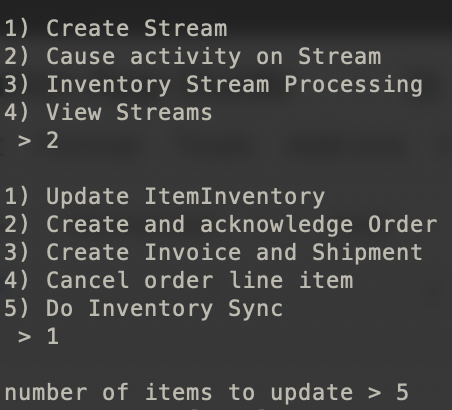

What did this do? It used your supplier trading partner Dsco account to randomly get five items from the Dsco, modified the quantity of the five items and then called a Dsco API to update the inventory quantity as the supplier. Dsco updated the quantity on these items and then checked to see if there were any inventory streams that were tied to that supplier account and if there were any, flowed these five item objects into those streams.

### Create and acknowledge Order

This menu item creates and acknowledges an order. We need orders created so we can add invoices for them, cancel items on them and mark them undeliverable.

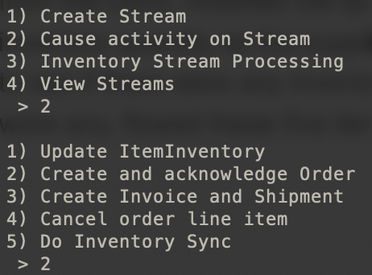

What did this do? It randomly picked an item from the Dsco supplier account you designated and used it to create an order. The new order that was generated was output afterward so you can copy the PO Number and use it elsewhere in your testing.

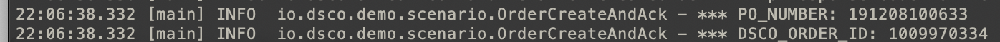

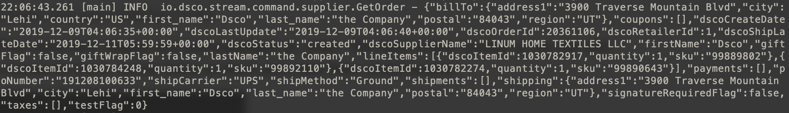

### Create Invoice and Shipment

This menu item creates an invoice with its accompanying shipment on an order.

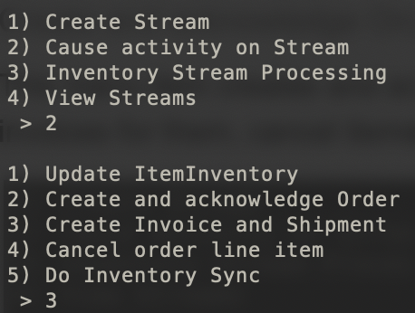

What did this do? It found an order that had not been shipped and invoiced and added an invoice to it. This will cause this invoice to flow into any invoice stream that you created.

### Cancel order line item

This menu item cancels a line item of an order.

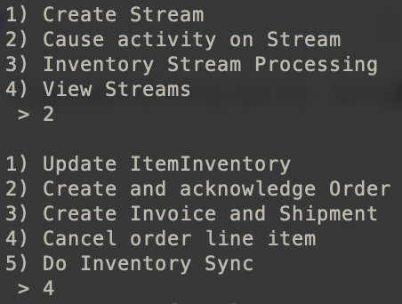

What did this do? It found an order that had been acknowledged and canceled an order line item on it. This will cause this order line item to flow into any OrderItemChange stream whose stream query’s “statuses” attribute includes the “cancelled” status indicating that all cancelled line items should flow into the given OrderItemChange stream.

### Do Inventory Sync

This menu item calls a Dsco API to dump all item inventory objects in the Dsco database into the stream you designate just as quickly as it can. This is used to do a daily sync of all data in Dsco’s inventory database. When you type this menu item you are prompted to provide the “streamId” of the stream you’d like to sync all objects to.

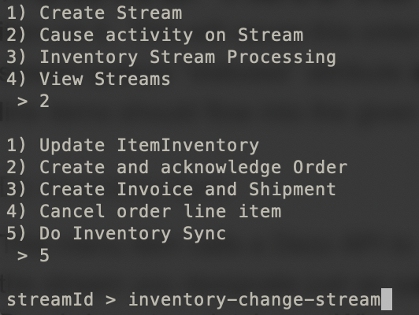

What did this do? It found the stream you specified. It then did a query for all item inventory tied to your retailer account, this can be millions of items of course, and then acts like they all changed, putting them into the stream as fast as it can. It does this by calling this API…

```
https:​//​staging-api.dsco.io​/doc/​v3​/reference/​#operation/createStreamOperation
```

Note that all objects that flow in a stream include an attribute named “source.” Source may have one of these two values:

* stream This indicates that the object was placed in the stream as part of normal stream processing as changed objects were detected inside your data or your trading partner’s data

* sync This indicates that the object was placed in the stream as a direct result of your requested sync operation on the stream

This API’s Responses, when clicked on, will display the stream object that can be returned.

```
https:​//​staging-api.dsco.io​/doc/​v3​/reference/​#operation/getStreamEventsFromPosition
```

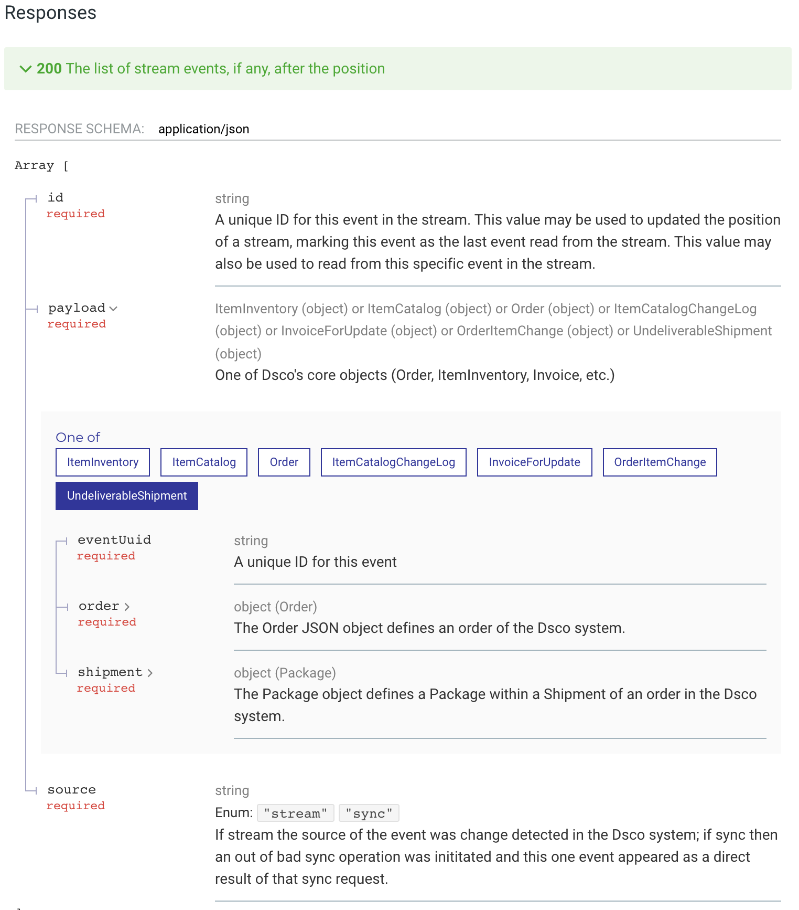

### Inventory Stream Processing

Type 3 and hit enter and you will see this menu, allowing the user to create or modify objects so that the change will flow down into any created streams that might be listening for this change.

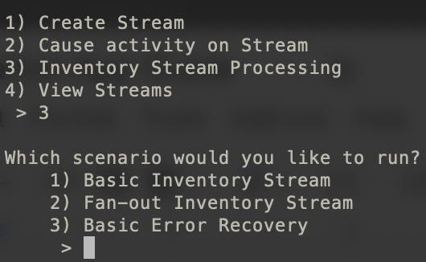

The app demonstrates all three main stream use cases for the inventory stream which in fact apply to other stream types as well.

### Basic Inventory Stream

The purpose of the basic stream use case is simply to demonstrate basic stream processing…

1. Get a stream object by its ID

1. Pull out the returned stream position

1. Call and get any new events after that stream position

1. Update the stream’s position, moving it forward in time as we pull down and successfully process events in the stream

This menu item prompts for the ID of the stream to retrieve events from and then retrieves the events. In my case I typed in a stream whose ID was “inventory-change-stream.” Afterward you will see output indicating what is happening.

[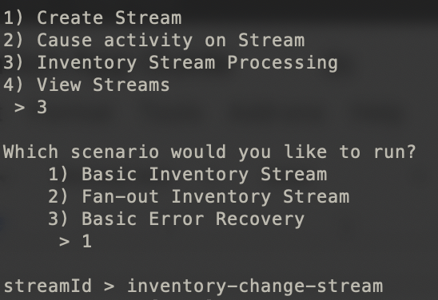

What did this do? First, it called this Dsco API, passing in the provided streamId to go get the stream by its ID.

```
https:​//​staging-api.dsco.io​/doc/​v3​/reference/​#operation/listStreams
```

The API returned the stream object that included the current position of the stream - the position attribute.

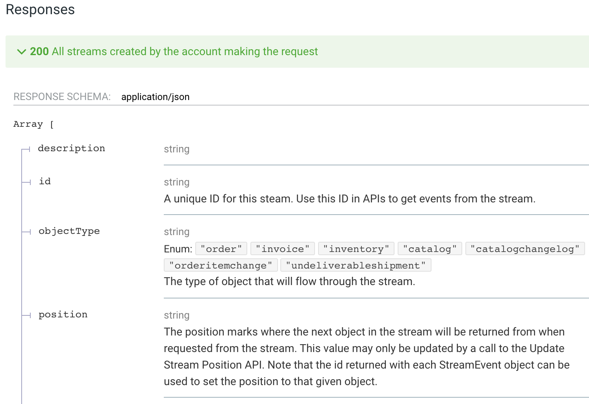

Then, it used the position to call in and get any events after that position using this API.

```
https:​//​staging-api.dsco.io​/doc/​v3​/reference/​#operation/getStreamEventsFromPosition
```

As it pulls down stream events, it periodically calls back up to this Dsco API to update the current position of the stream, moving it forward in time as we successfully process events from the stream.

```
https:​//​staging-api.dsco.io​/doc/​v3​/reference/​#operation/updateStreamPosition
```

### Fan-out Inventory Stream

Fan-out means to spin up parallel instances of a processor to scale horizontally and process data events from a stream more quickly. The purpose of the fan-out stream use case is demonstrate processing data in parallel from the stream without risking processing data out of order since it is assumed that processing the same inventory out of order could result in old inventory quantity values replacing newer values, which is very bad.

Note, this does **not** mean that multiple threads read from the same stream at the same time. Only one thread reads from a Dsco stream at a time. So, how does this help?

1. Let’s say there are 100,000 events waiting to be read from a Dsco stream

1. Let’s say it takes just a few minutes to read each event from the Dsco stream

1. Let’s say that each event, once it is pulled down by the retailer app from the Dsco stream, must be written to the retailer’s database

1. Let’s assume that it takes ½ a second to write each event into the retailer’s database, that would mean it would take 50,000 seconds which is nearly 14 hours and way too long

1. Let’s assume there are 16 cores on a given server that is running the app that reads the events from the Dsco stream

1. Let’s assume we designated a fan-out of 16 meaning that 16 independent threads were spun up to process these events simultaneously, each thread simply taking an event and writing it to the database

1. That would mean that best case, the 100,000 events could be processed in just under an hour

In the above scenario, we want the 16 parallel processors pulling down item inventory updates and processing them in parallel. However, we want to make sure we never allow an older update for a given item to come after a newer update which would cause the old item inventory quantity to get written to the database. There are many techniques to get around this. The app uses a simple hashing algorithm to make sure that the same thread always handles updates to the same items so this can’t ever happen.

This menu item prompts for…

* streamId The ID of the stream to retrieve events

* How many concurrent consumers The number of consumer or processor threads to run concurrently - this is the fan-out number

* Queue size This is the size of the queue in front of each thread; the app will pull down events from the Dsco stream as fast as it can and dish the events out to one of the 16 queues; the consumer threads will then pull events from its dedicated queue and write them to the retailer database; once all queues are filled to max, the app will stop pulling down events from Dsco until there is more room available in the queues

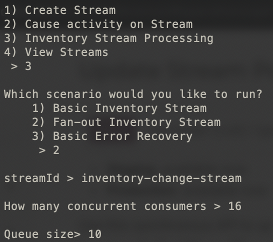

### Basic Error Recovery

At some point, it’s possible that you will need to go back in time and reprocess events that you already pulled down from the stream. Maybe for a day, your retailer database system was silently failing and no one knew. What do you do? Well, you continue letting your existing app that is constantly waking up and pulling down new events from the stream keep going. You start up a new app instance and tell it to pull down events from a specific date to a specific date and it will call Dsco, get the events in the given date range and you can process these old events as normal.

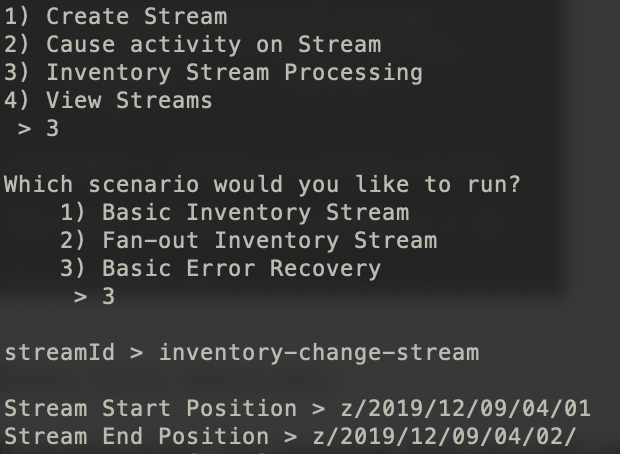

### View Streams

Type 4 and hit enter and you will see this menu, allowing the user to create or modify objects so that the change will flow down into any created streams that might be listening for this change.

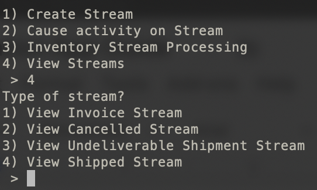
